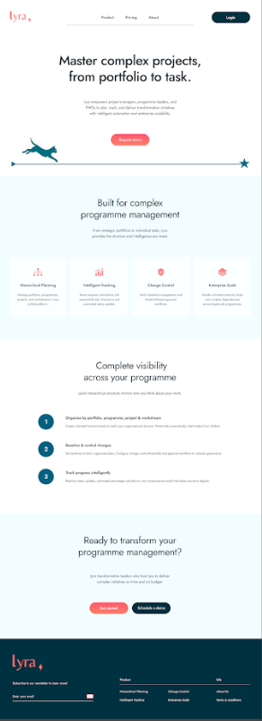
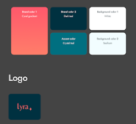

# Landing Page & Branding

This is the landing page to be created and defines the look and feel to be applied to the entire site.

## Landing Page

## Brand Identity

### Brand Colors

| Swatch | Name | Usage |
|--------|------|-------|
| Brand Color 1 | Coral gradient | Primary brand color |
| Brand Color 2 | Dark teal | Secondary brand color |
| Background Color 1 | White | Primary background |
| Accent Color | Crystal teal | Accent elements |
| Background Color 2 | Feather | Secondary background |

### Logo

The Lyra logo uses the coral/salmon color on a dark teal background, with a decorative star accent.

### Application

These colours, font, and logo are to be applied consistently across the entire site.
