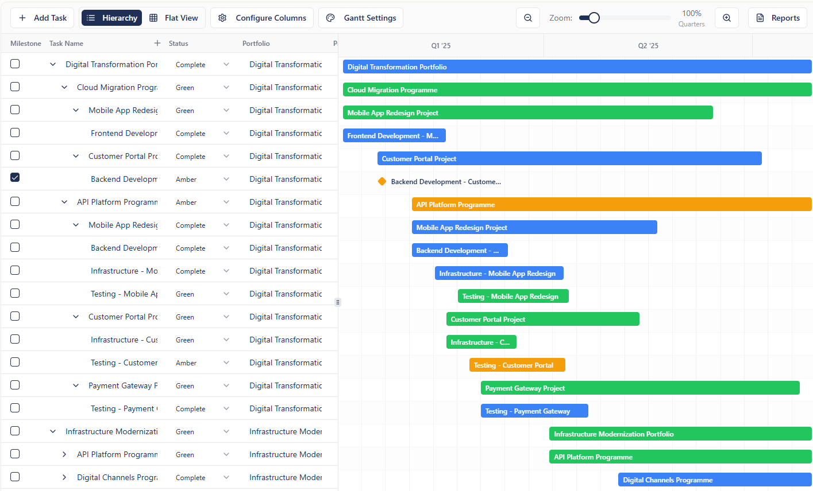

# Plan - Task Attributes & Screen Layout

## Plan Screen

### Screen Layout

- **Navigation panel** with headers
- **Two panels** underneath:
  - **Left panel**: Task grid
  - **Right panel**: Gantt chart
- User can populate either side and the other will be generated from whichever has data or is edited

### Toolbar

- Add Task
- Hierarchy / Flat View toggle
- Configure Columns
- Gantt Settings
- Search
- Zoom slider (5-year to weekly view)
- Reports button

## Default Task Attributes

| Attribute | Default Column Order | Type | Where Used | How Used |
|-----------|---------------------|------|------------|----------|
| Enterprise | — | Free text | All modules | Data available in filter lists — click on filter, expect to be able to see & search for data |
| Portfolio | 1 | Free text | All modules | As above |
| Programme | 2 | Free text | All modules | As above |
| Project | 3 | Free text | All modules | As above |
| Task name | 4 | Free text | All modules | As above |
| Start Date | 5 | Date: DD-MMM-YY | All modules | As above — needs to be consistent with data on plan page which is master data |
| Finish Date | 6 | Date: DD-MMM-YY | All modules | As above — needs to be consistent with data on plan page which is master data |
| Status | 7 | Choice (see below) | All modules | As above — needs to be consistent with data on plan page which is master data. Choices can be adjusted in settings. Parent values inherited from child values (from RAG). RAG drives gantt colour |
| % Complete | 8 | % | Plan calcs | Parent values inherited from child values |
| Milestone | — | Auto | Plan (gantt), Reporting | Calculated Yes/No. If Start Date = Finish Date, Milestone = Yes |

## Status Values

| Status | Definition | Default Colour |
|--------|-----------|----------------|
| Red | To be replanned | Red |
| Amber | At risk | Amber |
| Green | On schedule | Green |
| On Hold | Paused | Grey |
| Not Started | Not started | White with black border |
| Completed | Finished | Blue |

## Column Behaviour

- All columns are **filterable** with MS Excel-style filters that allow custom searches, "contains", etc. with a small filter icon
- Columns are **moveable**
- Can add **custom columns**
- Custom column value types: free text, symbols, date (calendar picker), currency, number, name (with directory look-up once feeds in place), location

## Task Entry & Editing

- Must be able to edit task data from **plan grid** or **gantt bar**
- Tabbing and clicking into edit data should work **as it does in Excel**
- Need one **horizontal** and one **vertical scroll bar** that is always visible

### Adding Tasks

Tasks can be added in the following ways:
1. Individually typed into the grid
2. Dragged from the task above (all or some cells)
3. Copied in from other sources (PowerPoint table, Excel, email, etc.)

Tasks can then be organised into the correct hierarchical structure.

## Time Travel

Add a slider bar "**time travel**" view of the project that shows the gantt and tasks and how it changed over time since the project was created.
