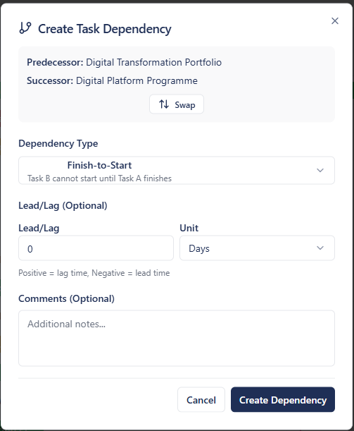
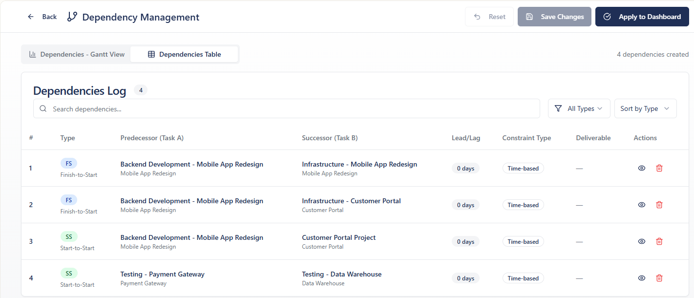

# Dependencies

## Overview

A dedicated dependency management workspace allows users to create, view, and manage task dependencies before publishing them to the plan. All decisions are easily reversible.

## Creating Dependencies

Add a **dependencies button** for the ability to create dependencies using a dependency dialogue box.

### Dependency Dialog Fields

- **Predecessor** (Task A)
- **Successor** (Task B)
- **Swap** button to reverse predecessor/successor
- **Dependency Type**: Finish-to-Start, Start-to-Start, etc.
- **Lead/Lag** (Optional): Positive = lag time, Negative = lead time, with unit selector (Days)
- **Comments** (Optional): Additional notes
- **Delete option** at the bottom

## Dependency Behaviour

- When a dependency is created, it creates a **relationship between the tasks** as described
- The link should be **visually clear** on the plan without being complex
- The dependency should be **easy to remove** by clicking on the visual indication and pressing delete

## Dependencies Workspace

A separate **Dependency Management** screen brings dependencies to the forefront visually while making other tasks less visually prominent.

### Dependencies Log Columns

| Column | Description |
|--------|-------------|
| # | Row number |
| Type | Dependency type (FS = Finish-to-Start, SS = Start-to-Start, etc.) |
| Predecessor (Task A) | The task that drives the relationship |
| Successor (Task B) | The dependent task |
| Lead/Lag | Time offset (e.g. 0 days) |
| Constraint Type | Time-based |
| Deliverable | Associated deliverable |
| Actions | View / Delete |

### Features

- **Gantt View** and **Table View** tabs
- Search dependencies
- Filter by type ("All Types")
- Sort by type
- **Save Changes** and **Apply to Dashboard** buttons
- **Reset** option

## Logging

- Dependencies are captured in the **dependencies log**
- All dependency changes are recorded in the **change audit log**
