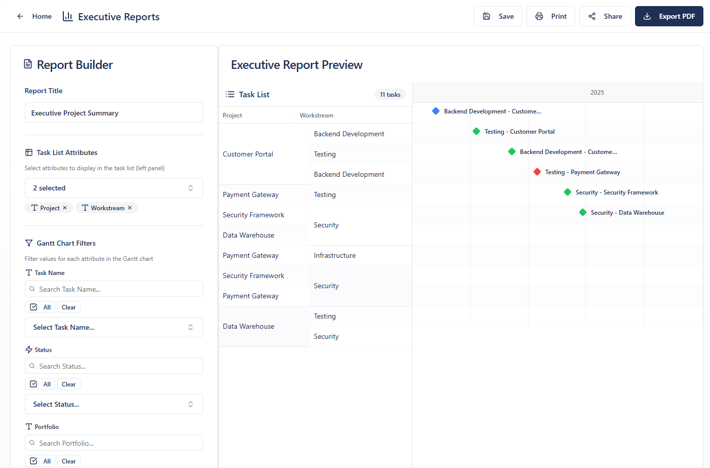

# Reporting

## Report Builder

### Building a Report

1. **Title**: User types a title. While typing, previously saved titles appear and are also available in a dropdown — not mandatory
2. **Task List Attributes**: User chooses attributes to appear on the left panel of the report
   - No minimum (can be zero) and no maximum, although a recommendation of maximum depending on visuals (TBC, ~4)
   - These attributes are **not a filter** — they are the values from the plan for the data selected for the report (e.g. Programme, Workstream)
3. **Gantt Chart Filters**: User chooses filters which define which tasks will appear in the report
   - e.g. Project X, Status = Red, Date Range = A–B
4. **Display Options**: User chooses whether to display **milestones** or **gantt bars** by ticking relevant checkbox
   - This pulls either milestones fitting the criteria or tasks, depending which is ticked (or both)
5. **Generate**: User generates report preview

## Report Editing

- Report preview is produced on screen including **critical path outline** and title
- User can edit the gantt/milestones display using the same settings and dialogue box as in the plan screen
- User can choose **'styles'** for reports: different headers, borders, swim-lanes

## Report Saving & Sharing

Once editing is completed, the below options are available:

| Action | Description |
|--------|-------------|
| Leave without saving | User can leave the module without saving |
| Save | Report can be saved and run again later |
| Share | Email, etc. |
| Export | PDF, Print, Excel, PowerPoint |

## Export Requirements

- **PDF, Print** must be available
- **Export to Excel, PPT and PDF** must look **best in class**
- Results of exports need to look **boardroom ready**

## Canned Reports

A set of canned reports should be available to choose from at the top:
- Status report
- Dashboard
- (Further types to be defined later)

## Layout Requirements

- Export button needs to include Excel and PowerPoint options
- Preview structure should be professionally presented (shading should not look random)
- Needs a **more helpful timeline**, more room for titles and headers, more professional-looking borders
- Options for headers and borders — as available in PowerPoint
- Report builder panel should be built in the same structure
- Icons next to field names should be removed — they are not helpful and take up too much room
